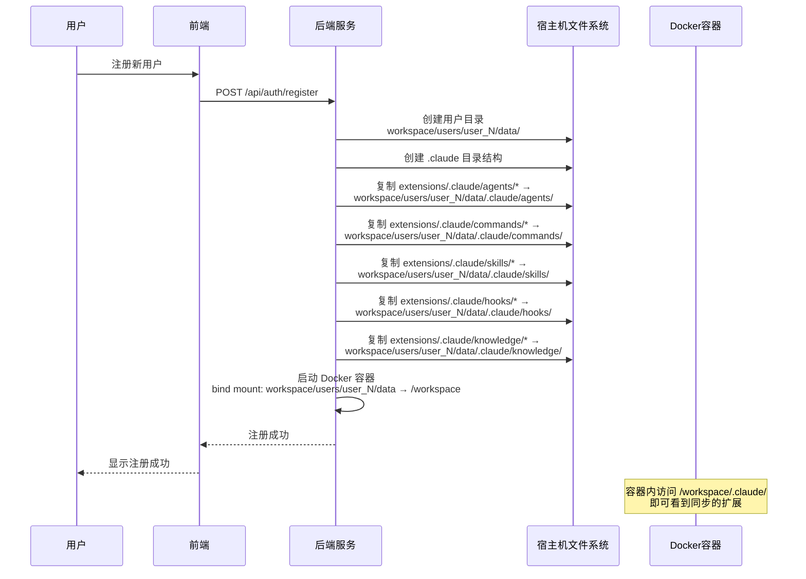
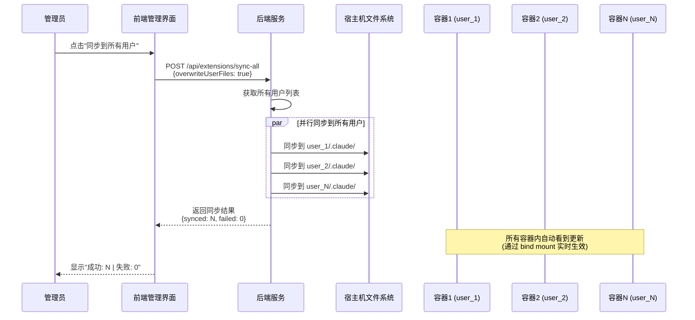

# 扩展功能预置方案

> **文档版本**: 2.1
> **创建时间**: 2026-01-18
> **最后更新**: 2026-01-19
> **所属架构**: Docker + Seccomp 容器隔离

---

## 目录

- [一、方案概述](#一方案概述)
- [二、目录结构设计](#二目录结构设计)
- [三、同步机制](#三同步机制)
- [四、实现方案](#四实现方案)
- [五、配置示例](#五配置示例)
- [六、API 接口设计](#六api-接口设计)
- [七、使用场景](#七使用场景)

---

## 一、方案概述

### 1.1 背景与目标

Docker 容器中运行的 AI 代码助手（Claude Code、OpenCode 等）支持 agent、skill、command 三种扩展机制。本方案旨在为平台提供一种统一的方式管理和预置这些扩展，使所有用户环境都能自动获得预置的功能扩展。

**核心目标**：
1. **集中管理**：在项目根目录统一维护预置的 agents、commands、skills
2. **自动同步**：用户注册时自动同步到用户目录
3. **简单覆盖**：使用最新版本覆盖旧版本
4. **热更新**：管理员可手动同步到所有用户

### 1.2 扩展类型

| 扩展类型 | 作用 | 存储位置 | 文件格式 |
|---------|------|----------|----------|
| **Agents** | Subagent 配置，定义专用代理行为 | `.claude/agents/` | `.json` |
| **Commands** | 自定义斜杠命令 | `.claude/commands/` | `.md` |
| **Skills** | Agent 技能，增强 AI 能力 | `.claude/skills/{name}/` | `SKILL.md` |
| **Hooks** | 钩子脚本，自定义事件处理 | `.claude/hooks/` | `.js` / `.md` |
| **Knowledge** | 知识库文件，提供领域知识 | `.claude/knowledge/` | `.md` / `.txt` |

### 1.3 配置作用域

根据 AI 代码助手官方规范，配置分为四个作用域（优先级从低到高）：

| 作用域 | 位置 | 说明 | 可否修改 |
|--------|------|------|----------|
| **Managed** | 预置扩展 | 系统预置，本方案管理 | 管理员 |
| **User** | `~/.claude/` | 用户级配置（本方案同步目标） | 是 |
| **Project** | `{project}/.claude/` | 项目级配置 | 是 |
| **Local** | `{project}/.claude/*.local.*` | 本地覆盖 | 是 |

**本方案实现 Managed → User 的预置同步**。

---

## 二、目录结构设计

### 2.1 宿主机项目根目录结构

在项目根目录新增 `extensions/` 目录用于管理预置扩展：

```
/path/to/ai-claude-code-ui/                 # 项目根目录
├── backend/                                # 后端代码
├── frontend/                               # 前端代码
├── dist/                                   # 构建产物
├── docs/                                   # 文档
├── extensions/                             # 🆕 预置扩展管理目录（Git Submodule）
│   └── .claude/                            # Claude 扩展目录
│       ├── README.md                       # 扩展管理说明文档
│       ├── agents/                         # 预置 Agents
│       │   ├── code-review.json            # 代码审查 Agent
│       │   ├── testing-agent.json          # 测试 Agent
│       │   └── documentation-agent.json    # 文档生成 Agent
│       ├── commands/                       # 预置 Commands
│       │   ├── review.md                   # 代码审查命令
│       │   ├── test.md                     # 测试命令
│       │   └── explain.md                  # 解释代码命令
│       ├── skills/                         # 预置 Skills
│       │   ├── code-analysis/              # 代码分析技能
│       │   │   └── SKILL.md
│       │   ├── git-workflow/               # Git 工作流技能
│       │   │   └── SKILL.md
│       │   └── best-practices/             # 最佳实践技能
│       │       └── SKILL.md
│       ├── hooks/                          # 预置 Hooks（可选）
│       └── knowledge/                      # 预置知识库（可选）
└── workspace/                              # 持久化数据目录（现有）
    ├── database/
    │   └── auth.db
    └── users/
        └── user_1/
            └── data/                       # 挂载到容器 /workspace
                └── .claude/                # 用户级配置（同步自 extensions/.claude/）
                    ├── agents/             # 同步自 extensions/.claude/agents/
                    │   ├── code-review.json
                    │   ├── testing-agent.json
                    │   └── documentation-agent.json
                    ├── commands/           # 同步自 extensions/.claude/commands/
                    │   ├── review.md
                    │   ├── test.md
                    │   └── explain.md
                    ├── skills/             # 同步自 extensions/.claude/skills/
                    │   ├── code-analysis/
                    │   ├── git-workflow/
                    │   └── best-practices/
                    ├── hooks/              # 同步自 extensions/.claude/hooks/
                    │   ├── pre-command.js
                    │   └── post-response.md
                    └── knowledge/          # 同步自 extensions/.claude/knowledge/
                        ├── best-practices.md
                        └── api-reference.txt
```

### 2.2 目录说明

| 目录 | 说明 | 内容 |
|------|------|------|
| **extensions/** | Git Submodule | 指向 https://github.com/fangfang023/claude-agent-orchestrator.git |
| **extensions/.claude/agents/** | 预置 Agents | `.json` 格式的 Subagent 配置文件 |
| **extensions/.claude/commands/** | 预置 Commands | `.md` 格式的斜杠命令定义 |
| **extensions/.claude/skills/** | 预置 Skills | 包含 `SKILL.md` 的目录 |
| **extensions/.claude/hooks/** | 预置 Hooks（可选） | `.js` 或 `.md` 格式的钩子脚本 |
| **extensions/.claude/knowledge/** | 预置知识库（可选） | `.md` 或 `.txt` 格式的知识库文件 |

### 2.3 扩展来源管理

**Git Submodule 方式**：
本项目的预置扩展通过 Git Submodule 管理，指向外部仓库 `https://github.com/fangfang023/claude-agent-orchestrator.git`。

```bash
# 更新 submodule 到最新版本
cd extensions
git pull origin main

# 在主项目中更新 submodule
git submodule update --remote extensions
```

**本地添加扩展**：
如需在本地添加自定义扩展，可直接添加到 `extensions/.claude/` 对应目录：

```bash
# 示例：添加本地扩展
cp /path/to/custom-agent.json extensions/.claude/agents/
cp /path/to/custom-command.md extensions/.claude/commands/
cp -r /path/to/custom-skill extensions/.claude/skills/
cp /path/to/custom-hook.js extensions/.claude/hooks/
cp /path/to/custom-knowledge.md extensions/.claude/knowledge/
```

### 2.4 目录权限与命名规范

| 规范项 | 说明 |
|--------|------|
| **文件权限** | 预置扩展文件：644 (rw-r--r--) |
| **目录权限** | 预置扩展目录：755 (rwxr-xr-x) |
| **资源命名** | kebab-case（如 `code-review.json`） |
| **编码格式** | UTF-8 |
| **换行符** | LF (Unix 风格) |

### 2.5 README 文档模板

`extensions/.claude/README.md` 说明文档：

```markdown
# AI 代码助手扩展

本目录包含平台预置的 agents、commands、skills、hooks、knowledge 扩展。

## 添加新扩展

1. 将 Agent 文件放到 `agents/` 目录
2. 将 Command 文件放到 `commands/` 目录
3. 将 Skill 目录放到 `skills/` 目录
4. 将 Hook 文件放到 `hooks/` 目录
5. 将 Knowledge 文件放到 `knowledge/` 目录

---

## 三、同步机制

### 3.1 同步时机（简化）

**仅支持两种同步方式**：

| 同步时机 | 触发方式 | 说明 |
|----------|----------|------|
| **初始化创建** | 用户注册时 | 创建用户目录时同步所有预置扩展 |
| **管理员热更新** | 手动触发 | 管理员主动同步到所有用户容器 |


### 3.2 合并策略

**原则**：直接复制，同名覆盖

| 场景 | 行为 |
|------|------|
| 新增扩展 | 直接复制到用户目录 |
| 同名扩展 | 用预置扩展覆盖用户目录中的文件 |
| 用户自定义 | 用户目录中已存在的文件可被覆盖（管理员可选择） |

**说明**：同步时将 `extensions/` 目录中的所有扩展复制到用户的 `.claude/` 目录。同名文件直接覆盖，确保用户获得最新版本的预置扩展。

### 3.3 初始化同步（用户注册时）

```javascript
// backend/services/users/user-registration.js
import { syncExtensions } from '../extensions/extension-sync.js';

export async function createUser(userData) {
  const userId = await saveUserToDatabase(userData);

  // 创建用户数据目录
  const userDataDir = path.join(workspaceDir, 'users', `user_${userId}`, 'data');
  await fs.mkdir(userDataDir, { recursive: true });

  // 创建 .claude 目录结构
  const claudeDir = path.join(userDataDir, '.claude');
  await fs.mkdir(path.join(claudeDir, 'agents'), { recursive: true });
  await fs.mkdir(path.join(claudeDir, 'commands'), { recursive: true });
  await fs.mkdir(path.join(claudeDir, 'skills'), { recursive: true });
  await fs.mkdir(path.join(claudeDir, 'hooks'), { recursive: true });
  await fs.mkdir(path.join(claudeDir, 'knowledge'), { recursive: true });

  // 🆕 合并同步所有组织的扩展
  await syncExtensions(claudeDir);

  return userId;
}
```

### 3.4 管理员热更新

```javascript
// backend/services/extensions/extension-sync.js
import { listAllUsers } from '../users/user-manager.js';

/**
 * 同步预置扩展到所有用户容器
 *
 * @param {Object} options - 同步选项
 * @param {boolean} options.overwriteUserFiles - 是否覆盖用户自定义文件（默认 false）
 */
export async function syncToAllUsers(options = {}) {
  const { overwriteUserFiles = false } = options;
  const users = await listAllUsers();

  const results = {
    total: users.length,
    synced: 0,
    failed: 0,
    errors: []
  };

  for (const user of users) {
    try {
      const claudeDir = path.join(workspaceDir, 'users', `user_${user.id}`, 'data', '.claude');
      await syncExtensions(claudeDir, { overwriteUserFiles });
      results.synced++;
    } catch (error) {
      results.failed++;
      results.errors.push({ userId: user.id, error: error.message });
    }
  }

  return results;
}
```

### 3.5 同步流程说明

**核心原理**：同步操作在宿主机完成，通过 Docker Volume Bind Mount 机制，容器内自动看到更新的文件。

#### 宿主机与容器路径映射

```
┌─────────────────────────────────────────────────────────────────┐
│                        宿主机                                   │
├─────────────────────────────────────────────────────────────────┤
│                                                                  │
│  项目根目录/                                                      │
│  ├── extensions/.claude/     ← 预置扩展源目录                    │
│  │   ├── agents/                                                │
│  │   ├── commands/                                              │
│  │   ├── skills/                                                │
│  │   ├── hooks/                                                 │
│  │   └── knowledge/                                             │
│  │                                                              │
│  └── workspace/users/user_1/                                     │
│      └── data/.claude/         ← 同步目标目录                    │
│          ├── agents/            同步自 extensions/.claude/agents/        │
│          ├── commands/          同步自 extensions/.claude/commands/      │
│          ├── skills/            同步自 extensions/.claude/skills/        │
│          ├── hooks/             同步自 extensions/.claude/hooks/         │
│          └── knowledge/         同步自 extensions/.claude/knowledge/     │
│                                                                  │
└─────────────────────────────────────────────────────────────────┘
                            │
                            │ Docker Volume Bind Mount
                            ▼
┌─────────────────────────────────────────────────────────────────┐
│                    Docker 容器 (claude-user-1)                    │
├─────────────────────────────────────────────────────────────────┤
│                                                                  │
│  /workspace/.claude/         ← 宿主机目录的映射                  │
│  ├── agents/                 容器内自动看到宿主机的文件          │
│  ├── commands/               宿主机修改后，容器内实时生效        │
│  └── skills/                                                          │
│                                                                  │
│  Claude Code SDK 读取 ~/.claude/ 即 /workspace/.claude/         │
│                                                                  │
└─────────────────────────────────────────────────────────────────┘
```

**关键点**：
1. 同步操作在**宿主机**完成（后端服务运行在宿主机）
2. 宿主机的 `workspace/users/user_X/data/` 被 bind mount 到容器的 `/workspace`
3. 同步完成后，容器内自动看到更新，无需额外操作

#### 时序图：初始化同步（用户注册时）



#### 时序图：管理员热更新同步



**流程说明**：
1. 管理员通过前端 API 触发同步
2. 后端服务在宿主机上执行文件复制操作
3. 源目录：`项目根/extensions/`
4. 目标目录：`workspace/users/user_X/data/.claude/`
5. 通过 Docker Volume Bind Mount，容器内自动看到更新
6. Claude Code SDK 在容器内读取 `~/.claude/` 即 `/workspace/.claude/`

---

## 四、实现方案

### 4.1 架构说明

**关键理解**：
- 后端服务运行在**宿主机**，不是在容器内
- 同步操作是宿主机上的文件复制（从一个目录到另一个目录）
- 容器通过 bind mount 看到宿主机的文件系统
- 宿主机文件更新后，容器内**自动**生效（无需进入容器操作）

**宿主机目录关系**：
```
项目根目录/
├── extensions/              ← Git Submodule（只读）
│   └── .claude/             ← 预置扩展目录
│       ├── agents/
│       ├── commands/
│       ├── skills/
│       ├── hooks/
│       └── knowledge/
│
└── workspace/users/        ← 用户数据（可写，同步目标）
    └── user_1/data/
        └── .claude/         ← 同步目标，bind mount 到容器的 /workspace
            ├── agents/     ← 从 extensions/.claude/agents/ 同步
            ├── commands/   ← 从 extensions/.claude/commands/ 同步
            ├── skills/     ← 从 extensions/.claude/skills/ 同步
            ├── hooks/      ← 从 extensions/.claude/hooks/ 同步
            └── knowledge/  ← 从 extensions/.claude/knowledge/ 同步
```

**Docker 容器启动配置**（参考）：
```javascript
const containerConfig = {
  Image: 'claude-code:latest',
  HostConfig: {
    Binds: [
      '/path/to/project/workspace/users/user_1/data:/workspace'  // bind mount
    ],
    Env: [
      'HOME=/workspace'  // 容器内 HOME 指向 /workspace
    ]
  }
};
```

---

### 4.2 核心服务模块

#### 4.2.1 扩展同步服务

```javascript
// backend/services/extensions/extension-sync.js
import path from 'path';
import fs from 'fs/promises';
import { fileURLToPath } from 'url';
import { dirname } from 'path';

const __filename = fileURLToPath(import.meta.url);
const __dirname = dirname(__filename);

// 路径说明：本文件位于 backend/services/extensions/extension-sync.js
// 项目根目录 = __dirname 向上 4 级 (extensions -> services -> backend -> 项目根)
// 与 data-storage-design.md 中的规范保持一致
const PROJECT_ROOT = path.resolve(__dirname, '../../..');
const EXTENSIONS_DIR = path.join(PROJECT_ROOT, 'extensions', '.claude');

// 用户数据目录：workspace/users/user_{id}/data/.claude/
// 符合 data-storage-design.md §5.1 宿主机目录规范
// 容器内挂载到 /workspace，容器内 /workspace/.claude/ 即 ~/.claude/

/**
 * 同步预置扩展到用户目录
 *
 * @param {string} targetDir - 目标 .claude 目录
 * @param {Object} options - 同步选项
 * @param {boolean} options.overwriteUserFiles - 是否覆盖用户自定义文件（默认 true）
 */
export async function syncExtensions(targetDir, options = {}) {
  const { overwriteUserFiles = true } = options;

  const results = {
    agents: { synced: 0, errors: [] },
    commands: { synced: 0, errors: [] },
    skills: { synced: 0, errors: [] },
    hooks: { synced: 0, errors: [] },
    knowledge: { synced: 0, errors: [] }
  };

  try {
    // 确保目标目录存在
    await fs.mkdir(path.join(targetDir, 'agents'), { recursive: true });
    await fs.mkdir(path.join(targetDir, 'commands'), { recursive: true });
    await fs.mkdir(path.join(targetDir, 'skills'), { recursive: true });
    await fs.mkdir(path.join(targetDir, 'hooks'), { recursive: true });
    await fs.mkdir(path.join(targetDir, 'knowledge'), { recursive: true });

    // 同步 Agents
    await syncResourceType('agents', targetDir, results.agents, overwriteUserFiles);

    // 同步 Commands
    await syncResourceType('commands', targetDir, results.commands, overwriteUserFiles);

    // 同步 Skills
    await syncResourceType('skills', targetDir, results.skills, overwriteUserFiles);

    // 同步 Hooks
    await syncResourceType('hooks', targetDir, results.hooks, overwriteUserFiles);

    // 同步 Knowledge
    await syncResourceType('knowledge', targetDir, results.knowledge, overwriteUserFiles);

    return results;
  } catch (error) {
    console.error('Failed to sync extensions:', error);
    throw error;
  }
}

/**
 * 同步特定类型的资源
 */
async function syncResourceType(type, targetDir, results, overwrite) {
  const sourceDir = path.join(EXTENSIONS_DIR, type);
  const targetSubDir = path.join(targetDir, type);

  if (!await directoryExists(sourceDir)) {
    return; // 源目录不存在，跳过
  }

  const entries = await fs.readdir(sourceDir, { withFileTypes: true });

  // 文件类型扩展名映射
  const fileExtensions = {
    agents: ['.json'],
    commands: ['.md'],
    hooks: ['.js', '.md'],
    knowledge: ['.md', '.txt']
  };

  for (const entry of entries) {
    if (entry.name === 'README.md' || entry.name.startsWith('.')) {
      continue;
    }

    try {
      if (type === 'skills') {
        // Skills 是目录
        if (entry.isDirectory()) {
          const sourcePath = path.join(sourceDir, entry.name);
          const targetPath = path.join(targetSubDir, entry.name);

          if (!overwrite && await directoryExists(targetPath)) {
            continue;
          }

          await copyDirectory(sourcePath, targetPath);
          results.synced++;
        }
      } else if (type === 'hooks' || type === 'knowledge') {
        // Hooks 和 Knowledge 支持文件和目录
        if (entry.isFile()) {
          const ext = path.extname(entry.name);
          const allowedExts = fileExtensions[type] || [];

          if (allowedExts.includes(ext)) {
            const sourcePath = path.join(sourceDir, entry.name);
            const targetPath = path.join(targetSubDir, entry.name);

            if (!overwrite && await fileExists(targetPath)) {
              continue;
            }

            await fs.copyFile(sourcePath, targetPath);
            results.synced++;
          }
        } else if (entry.isDirectory()) {
          // 支持子目录（用于知识库分类）
          const sourcePath = path.join(sourceDir, entry.name);
          const targetPath = path.join(targetSubDir, entry.name);

          if (!overwrite && await directoryExists(targetPath)) {
            continue;
          }

          await copyDirectory(sourcePath, targetPath);
          results.synced++;
        }
      } else {
        // Agents 和 Commands 是文件
        if (entry.isFile()) {
          const sourcePath = path.join(sourceDir, entry.name);
          const targetPath = path.join(targetSubDir, entry.name);

          if (!overwrite && await fileExists(targetPath)) {
            continue;
          }

          await fs.copyFile(sourcePath, targetPath);
          results.synced++;
        }
      }
    } catch (error) {
      results.errors.push({ resource: entry.name, error: error.message });
    }
  }
}

/**
 * 检查目录是否存在
 */
async function directoryExists(dirPath) {
  try {
    const stats = await fs.stat(dirPath);
    return stats.isDirectory();
  } catch {
    return false;
  }
}

/**
 * 检查文件是否存在
 */
async function fileExists(filePath) {
  try {
    await fs.access(filePath);
    return true;
  } catch {
    return false;
  }
}

/**
 * 复制目录
 */
async function copyDirectory(source, target) {
  await fs.mkdir(target, { recursive: true });
  const entries = await fs.readdir(source, { withFileTypes: true });

  for (const entry of entries) {
    if (entry.name.startsWith('.')) {
      continue;
    }

    const sourcePath = path.join(source, entry.name);
    const targetPath = path.join(target, entry.name);

    if (entry.isDirectory()) {
      await copyDirectory(sourcePath, targetPath);
    } else {
      await fs.copyFile(sourcePath, targetPath);
    }
  }
}

/**
 * 获取所有可用的扩展列表
 */
export async function getAllExtensions() {
  const extensions = {
    agents: [],
    commands: [],
    skills: [],
    hooks: [],
    knowledge: []
  };

  // 读取 Agents
  const agentsDir = path.join(EXTENSIONS_DIR, 'agents');
  if (await directoryExists(agentsDir)) {
    const entries = await fs.readdir(agentsDir, { withFileTypes: true });
    for (const entry of entries) {
      if (entry.isFile() && entry.name.endsWith('.json')) {
        const filePath = path.join(agentsDir, entry.name);
        try {
          const content = JSON.parse(await fs.readFile(filePath, 'utf-8'));
          extensions.agents.push({
            filename: entry.name,
            name: content.name || entry.name.replace('.json', ''),
            description: content.description || ''
          });
        } catch {
          extensions.agents.push({
            filename: entry.name,
            name: entry.name.replace('.json', ''),
            description: '[解析失败]'
          });
        }
      }
    }
  }

  // 读取 Commands
  const commandsDir = path.join(EXTENSIONS_DIR, 'commands');
  if (await directoryExists(commandsDir)) {
    const entries = await fs.readdir(commandsDir, { withFileTypes: true });
    for (const entry of entries) {
      if (entry.isFile() && entry.name.endsWith('.md')) {
        extensions.commands.push({
          filename: entry.name,
          name: entry.name.replace('.md', '')
        });
      }
    }
  }

  // 读取 Skills
  const skillsDir = path.join(EXTENSIONS_DIR, 'skills');
  if (await directoryExists(skillsDir)) {
    const entries = await fs.readdir(skillsDir, { withFileTypes: true });
    for (const entry of entries) {
      if (entry.isDirectory() && !entry.name.startsWith('.')) {
        const skillMdPath = path.join(skillsDir, entry.name, 'SKILL.md');

        let description = '';
        if (await fileExists(skillMdPath)) {
          const content = await fs.readFile(skillMdPath, 'utf-8');
          const match = content.match(/^#\s+(.+)$/m);
          description = match ? match[1] : '';
        }

        extensions.skills.push({
          name: entry.name,
          description
        });
      }
    }
  }

  // 读取 Hooks (.js 和 .md 文件)
  const hooksDir = path.join(EXTENSIONS_DIR, 'hooks');
  if (await directoryExists(hooksDir)) {
    const entries = await fs.readdir(hooksDir, { withFileTypes: true });
    for (const entry of entries) {
      if (entry.isFile()) {
        const ext = path.extname(entry.name);
        if (ext === '.js' || ext === '.md') {
          const filePath = path.join(hooksDir, entry.name);

          let description = '';
          try {
            const content = await fs.readFile(filePath, 'utf-8');
            // 对于 .js 文件，尝试提取注释中的描述
            if (ext === '.js') {
              const match = content.match(/\/\*\*\s*([^*]|\*(?!\/))*\*\//);
              description = match ? match[0].substring(2, match[0].length - 2).trim().substring(0, 100) : 'JavaScript Hook';
            } else {
              // 对于 .md 文件，提取第一个标题
              const match = content.match(/^#\s+(.+)$/m);
              description = match ? match[1] : '';
            }
          } catch {
            description = ext === '.js' ? 'JavaScript Hook' : 'Markdown Hook';
          }

          extensions.hooks.push({
            filename: entry.name,
            name: entry.name.replace(/\.(js|md)$/, ''),
            type: ext.substring(1),
            description
          });
        }
      }
    }
  }

  // 读取 Knowledge (.md 和 .txt 文件及目录)
  const knowledgeDir = path.join(EXTENSIONS_DIR, 'knowledge');
  if (await directoryExists(knowledgeDir)) {
    const entries = await fs.readdir(knowledgeDir, { withFileTypes: true });
    for (const entry of entries) {
      if (entry.isFile()) {
        const ext = path.extname(entry.name);
        if (ext === '.md' || ext === '.txt') {
          const filePath = path.join(knowledgeDir, entry.name);

          let description = '';
          try {
            const content = await fs.readFile(filePath, 'utf-8');
            if (ext === '.md') {
              const match = content.match(/^#\s+(.+)$/m);
              description = match ? match[1] : content.substring(0, 100).trim();
            } else {
              description = content.substring(0, 100).trim();
            }
          } catch {
            description = 'Knowledge File';
          }

          extensions.knowledge.push({
            filename: entry.name,
            name: entry.name.replace(/\.(md|txt)$/, ''),
            type: ext.substring(1),
            description
          });
        }
      } else if (entry.isDirectory() && !entry.name.startsWith('.')) {
        // 知识库子目录
        extensions.knowledge.push({
          filename: entry.name + '/',
          name: entry.name,
          type: 'dir',
          description: 'Knowledge Directory'
        });
      }
    }
  }

  return extensions;
}
```

#### 4.2.2 扩展管理 API 路由

```javascript
// backend/routes/api/extensions.js
import express from 'express';
import {
  syncExtensions,
  syncToAllUsers,
  getAllExtensions
} from '../../services/extensions/extension-sync.js';
import { requireAdmin } from '../../middleware/auth.js';

const router = express.Router();

/**
 * GET /api/extensions
 * 获取所有可用的扩展列表
 */
router.get('/', requireAdmin, async (req, res) => {
  try {
    const extensions = await getAllExtensions();
    res.json({ success: true, data: extensions });
  } catch (error) {
    res.status(500).json({ success: false, error: error.message });
  }
});

/**
 * POST /api/extensions/sync-all
 * 同步扩展到所有用户
 */
router.post('/sync-all', requireAdmin, async (req, res) => {
  try {
    const { overwriteUserFiles = false } = req.body;
    const results = await syncToAllUsers({ overwriteUserFiles });
    res.json({ success: true, data: results });
  } catch (error) {
    res.status(500).json({ success: false, error: error.message });
  }
});

/**
 * POST /api/extensions/sync-user
 * 同步扩展到指定用户
 */
router.post('/sync-user', requireAdmin, async (req, res) => {
  try {
    const { userId, overwriteUserFiles = false } = req.body;

    if (!userId) {
      return res.status(400).json({ success: false, error: 'userId is required' });
    }

    const claudeDir = path.join(workspaceDir, 'users', `user_${userId}`, 'data', '.claude');
    const results = await syncExtensions(claudeDir, { overwriteUserFiles });

    res.json({ success: true, data: results });
  } catch (error) {
    res.status(500).json({ success: false, error: error.message });
  }
});

export default router;
```

### 4.3 集成点

#### 4.3.1 用户注册流程

```javascript
// backend/services/users/user-registration.js（修改现有代码）
import { syncExtensions } from '../extensions/extension-sync.js';

// 在创建用户目录后添加
await syncExtensions(claudeDir);
```

### 4.4 前端管理界面（可选）

```typescript
// frontend/features/admin/components/ExtensionManagement.tsx
import React, { useEffect, useState } from 'react';

interface ExtensionsData {
  agents: Array<{ name: string; description: string }>;
  commands: Array<{ name: string }>;
  skills: Array<{ name: string; description: string }>;
  hooks: Array<{ name: string; type: string; description: string }>;
  knowledge: Array<{ name: string; type: string; description: string }>;
}

export function ExtensionManagement() {
  const [extensions, setExtensions] = useState<ExtensionsData | null>(null);
  const [syncing, setSyncing] = useState(false);
  const [syncResults, setSyncResults] = useState<any>(null);

  const fetchExtensions = async () => {
    const response = await fetch('/api/extensions');
    const data = await response.json();
    setExtensions(data.data);
  };

  const syncToAll = async () => {
    setSyncing(true);
    const response = await fetch('/api/extensions/sync-all', {
      method: 'POST',
      headers: { 'Content-Type': 'application/json' },
      body: JSON.stringify({ overwriteUserFiles: true })
    });
    const data = await response.json();
    setSyncResults(data.data);
    setSyncing(false);
  };

  useEffect(() => {
    fetchExtensions();
  }, []);

  if (!extensions) return <div>Loading...</div>;

  return (
    <div className="p-6">
      <h1 className="text-2xl font-bold mb-6">扩展预置管理</h1>

      {/* 统计概览 */}
      <div className="grid grid-cols-5 gap-4 mb-6">
        <div className="p-4 bg-blue-50 rounded-lg">
          <div className="text-2xl font-bold text-blue-600">{extensions.agents.length}</div>
          <div className="text-sm text-gray-600">Agents</div>
        </div>
        <div className="p-4 bg-green-50 rounded-lg">
          <div className="text-2xl font-bold text-green-600">{extensions.commands.length}</div>
          <div className="text-sm text-gray-600">Commands</div>
        </div>
        <div className="p-4 bg-purple-50 rounded-lg">
          <div className="text-2xl font-bold text-purple-600">{extensions.skills.length}</div>
          <div className="text-sm text-gray-600">Skills</div>
        </div>
        <div className="p-4 bg-orange-50 rounded-lg">
          <div className="text-2xl font-bold text-orange-600">{extensions.hooks.length}</div>
          <div className="text-sm text-gray-600">Hooks</div>
        </div>
        <div className="p-4 bg-teal-50 rounded-lg">
          <div className="text-2xl font-bold text-teal-600">{extensions.knowledge.length}</div>
          <div className="text-sm text-gray-600">Knowledge</div>
        </div>
      </div>

      {/* 同步按钮 */}
      <div className="mb-6">
        <button
          onClick={syncToAll}
          disabled={syncing}
          className="px-4 py-2 bg-blue-600 text-white rounded disabled:bg-gray-400"
        >
          {syncing ? '同步中...' : '同步到所有用户'}
        </button>

        {syncResults && (
          <div className="mt-2 text-sm">
            成功: {syncResults.synced} | 失败: {syncResults.failed}
          </div>
        )}
      </div>

      {/* 扩展列表 */}
      <div className="grid grid-cols-5 gap-6">
        {/* Agents */}
        <div className="p-4 border rounded-lg">
          <h2 className="text-lg font-bold mb-4">Agents ({extensions.agents.length})</h2>
          <ul className="space-y-2">
            {extensions.agents.map(agent => (
              <li key={agent.name} className="text-sm">
                <div className="font-medium">{agent.name}</div>
                <div className="text-gray-500">{agent.description}</div>
              </li>
            ))}
          </ul>
        </div>

        {/* Commands */}
        <div className="p-4 border rounded-lg">
          <h2 className="text-lg font-bold mb-4">Commands ({extensions.commands.length})</h2>
          <ul className="space-y-2">
            {extensions.commands.map(cmd => (
              <li key={cmd.name} className="text-sm">{cmd.name}</li>
            ))}
          </ul>
        </div>

        {/* Skills */}
        <div className="p-4 border rounded-lg">
          <h2 className="text-lg font-bold mb-4">Skills ({extensions.skills.length})</h2>
          <ul className="space-y-2">
            {extensions.skills.map(skill => (
              <li key={skill.name} className="text-sm">
                <div className="font-medium">{skill.name}</div>
                <div className="text-gray-500">{skill.description}</div>
              </li>
            ))}
          </ul>
        </div>

        {/* Hooks */}
        <div className="p-4 border rounded-lg">
          <h2 className="text-lg font-bold mb-4">Hooks ({extensions.hooks.length})</h2>
          <ul className="space-y-2">
            {extensions.hooks.map(hook => (
              <li key={hook.name} className="text-sm">
                <div className="flex items-center gap-1">
                  <span className="font-medium">{hook.name}</span>
                  <span className="text-xs px-1 py-0 bg-gray-200 rounded">{hook.type}</span>
                </div>
                <div className="text-gray-500 text-xs">{hook.description}</div>
              </li>
            ))}
          </ul>
        </div>

        {/* Knowledge */}
        <div className="p-4 border rounded-lg">
          <h2 className="text-lg font-bold mb-4">Knowledge ({extensions.knowledge.length})</h2>
          <ul className="space-y-2">
            {extensions.knowledge.map(knowledge => (
              <li key={knowledge.name} className="text-sm">
                <div className="flex items-center gap-1">
                  <span className="font-medium">{knowledge.name}</span>
                  <span className="text-xs px-1 py-0 bg-gray-200 rounded">{knowledge.type}</span>
                </div>
                <div className="text-gray-500 text-xs">{knowledge.description}</div>
              </li>
            ))}
          </ul>
        </div>
      </div>
    </div>
  );
}
```

## 六、API 接口设计

### 6.1 管理员接口

| 接口 | 方法 | 说明 | 权限 |
|------|------|------|------|
| `/api/extensions` | GET | 获取所有可用扩展列表 | Admin |
| `/api/extensions/sync-all` | POST | 同步扩展到所有用户 | Admin |
| `/api/extensions/sync-user` | POST | 同步扩展到指定用户 | Admin |

## 相关文档
- [数据存储设计](./data-storage-design.md)
- [核心模块设计](./core-modules-design.md)
- [安全与部署配置](./security-deployment-config.md)

---

**文档维护**

本文档应根据实际实施情况持续更新。如有任何疑问或建议，请联系项目维护者。
