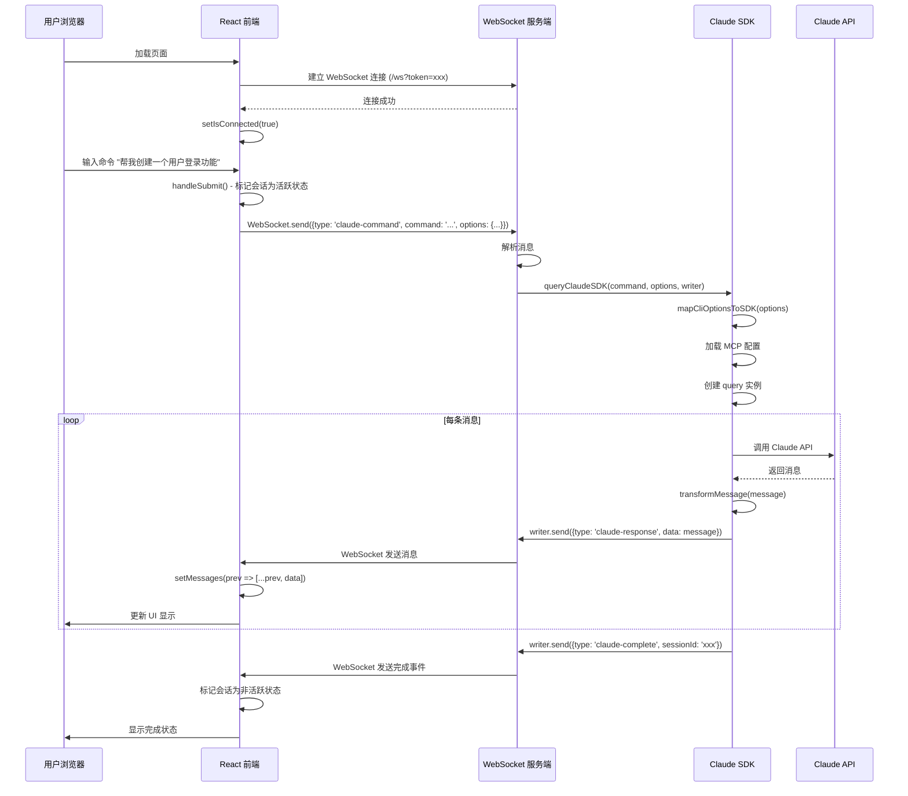
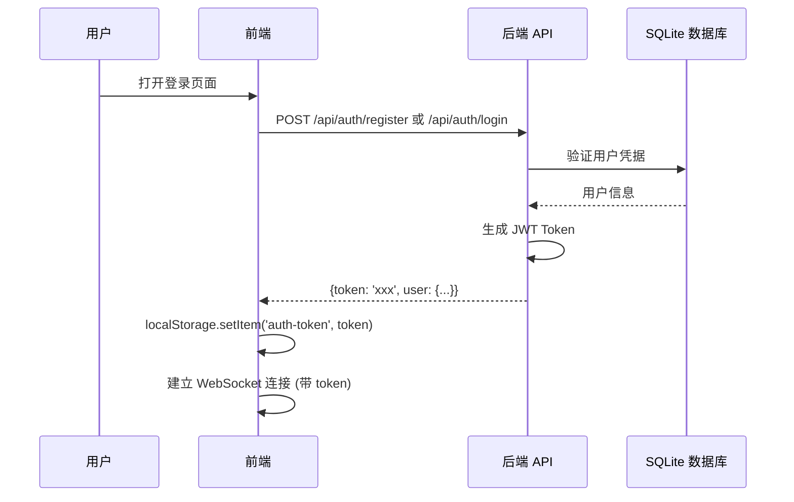
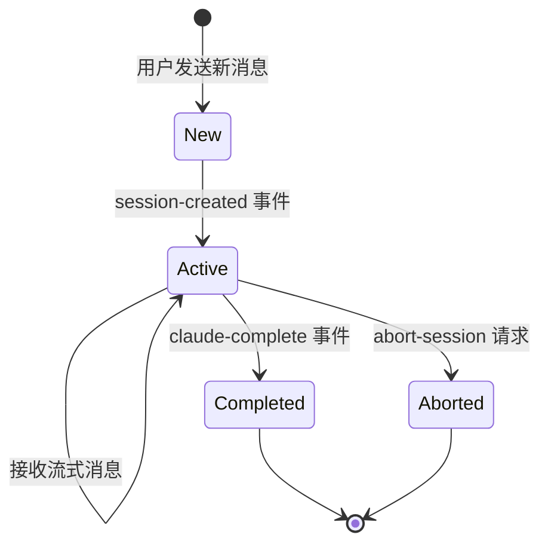
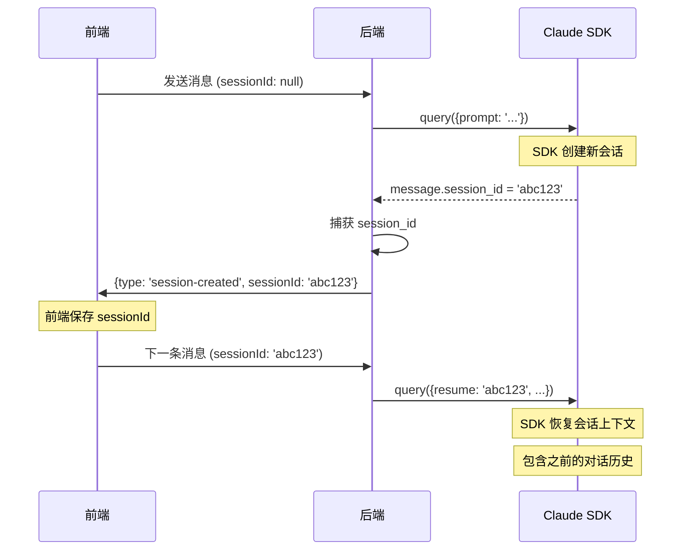
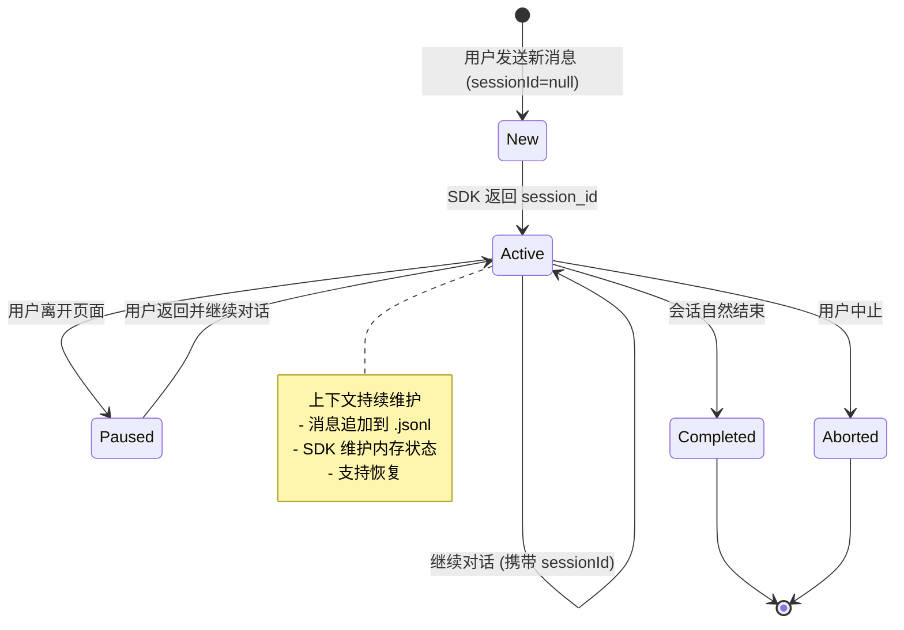

# Claude Code UI - 架构调研文档

## 1. 项目概述

### 1.1 项目简介

Claude Code UI 是一个全栈 Web 应用程序，为 Claude Code CLI、Cursor CLI 和 OpenAI Codex 提供 Web 界面。这是一个单包项目（非 monorepo），包含前端和后端组件。

### 1.2 技术栈

| 层级 | 技术 |
|------|------|
| 前端框架 | React 18 + Vite |
| 后端框架 | Express.js + WebSocket (ws) |
| 数据库 | SQLite (better-sqlite3) |
| 样式 | Tailwind CSS |
| SDK | @anthropic-ai/claude-agent-sdk |
| 认证 | JWT + API Key |

### 1.3 项目目录结构

```
ai-claude-code-ui/
├── server/                 # 后端 Node.js 服务器
│   ├── routes/             # API 路由处理器
│   ├── database/           # SQLite 数据库操作
│   ├── claude-sdk.js       # Claude SDK 集成
│   ├── cursor-cli.js       # Cursor CLI 集成
│   ├── openai-codex.js     # OpenAI Codex 集成
│   ├── projects.js         # 项目发现和管理
│   └── middleware/         # 中间件
├── src/                    # 前端 React 应用
│   ├── components/         # React 组件
│   ├── contexts/           # React Context 状态管理
│   ├── hooks/              # 自定义 React Hooks
│   └── utils/              # 前端工具函数
├── shared/                 # 共享常量和工具
├── public/                 # 静态资源
└── dist/                   # 构建后的前端资源
```

---

## 2. 整体实现框架

### 2.1 系统架构图

```
┌─────────────────────────────────────────────────────────────────────┐
│                         客户端层 (Browser)                            │
│  ┌────────────────────────────────────────────────────────────────┐  │
│  │  React 18 + Vite                                                │  │
│  │  ┌──────────────┐  ┌──────────────┐  ┌──────────────────────┐  │  │
│  │  │ ChatInterface│  │  FileTree    │  │   GitPanel           │  │  │
│  │  │  (消息交互)   │  │  (文件浏览)  │  │   (Git 操作)         │  │  │
│  │  └──────────────┘  └──────────────┘  └──────────────────────┘  │  │
│  │  ┌──────────────────────────────────────────────────────────┐  │  │
│  │  │         WebSocketContext (实时通信层)                     │  │  │
│  │  └──────────────────────────────────────────────────────────┘  │  │
│  └────────────────────────────────────────────────────────────────┘  │
└─────────────────────────────────────────────────────────────────────┘
                                    │
                                    │ WebSocket / HTTP
                                    ▼
┌─────────────────────────────────────────────────────────────────────┐
│                         服务端层 (Node.js)                            │
│  ┌────────────────────────────────────────────────────────────────┐  │
│  │  Express.js + WebSocket Server                                 │  │
│  │  ┌──────────────┐  ┌──────────────┐  ┌──────────────────────┐  │  │
│  │  │  API Routes  │  │WebSocket Hdlr│  │   File System        │  │  │
│  │  │  (REST API)  │  │(/ws, /shell) │  │   (文件监视)          │  │  │
│  │  └──────────────┘  └──────────────┘  └──────────────────────┘  │  │
│  └────────────────────────────────────────────────────────────────┘  │
│  ┌────────────────────────────────────────────────────────────────┐  │
│  │  Agent SDK Integration Layer                                    │  │
│  │  ┌──────────────┐  ┌──────────────┐  ┌──────────────────────┐  │  │
│  │  │claude-sdk.js │  │cursor-cli.js │  │  openai-codex.js     │  │  │
│  │  │(Claude SDK)  │  │(Cursor CLI)  │  │  (OpenAI Codex)      │  │  │
│  │  └──────────────┘  └──────────────┘  └──────────────────────┘  │  │
│  └────────────────────────────────────────────────────────────────┘  │
│  ┌────────────────────────────────────────────────────────────────┐  │
│  │  SQLite Database (用户、API Key、凭据、Git 配置)                │  │
│  └────────────────────────────────────────────────────────────────┘  │
└─────────────────────────────────────────────────────────────────────┘
                                    │
                                    │ SDK / CLI
                                    ▼
┌─────────────────────────────────────────────────────────────────────┐
│                      AI Agent 层                                       │
│  ┌──────────────┐  ┌──────────────┐  ┌──────────────────────┐       │
│  │ Claude Agent │  │ Cursor Agent │  │  OpenAI Codex        │       │
│  │   (SDK)      │  │   (CLI)      │  │   (SDK/CLI)          │       │
│  └──────────────┘  └──────────────┘  └──────────────────────┘       │
└─────────────────────────────────────────────────────────────────────┘
```

### 2.2 数据流架构

```
用户输入 → 前端组件 → WebSocket → 服务端路由 → Agent SDK → AI 响应
    ↑                                                                ↓
    └───────────────────────── 实时消息流 ←──────────────────────────┘
```

---

## 3. 前端-后端-Agent 数据连接方式

### 3.1 通信架构概览

```
┌────────────────────────────────────────────────────────────────────┐
│                          前端 (React)                                │
│  ┌──────────────────────────────────────────────────────────────┐  │
│  │  useWebSocket Hook                                            │  │
│  │  - ws: WebSocket 实例                                          │  │
│  │  - sendMessage: 发送消息                                       │  │
│  │  - messages: 接收消息队列                                       │  │
│  │  - isConnected: 连接状态                                        │  │
│  └──────────────────────────────────────────────────────────────┘  │
└────────────────────────────────────────────────────────────────────┘
                              │
                              │ WebSocket 连接
                              │ ws://host:port/ws?token=xxx
                              ▼
┌────────────────────────────────────────────────────────────────────┐
│                      后端 WebSocket 服务器                            │
│  ┌──────────────────────────────────────────────────────────────┐  │
│  │  WebSocketWriter (适配器模式)                                  │  │
│  │  - send(data): 发送数据到前端                                  │  │
│  │  - setSessionId(id): 设置会话ID                                │  │
│  │  - getSessionId(): 获取会话ID                                  │  │
│  └──────────────────────────────────────────────────────────────┘  │
│                              │                                       │
│                              │ 调用                                   │
│                              ▼                                       │
│  ┌──────────────────────────────────────────────────────────────┐  │
│  │  queryClaudeSDK() / spawnCursor() / queryCodex()              │  │
│  │  (Agent 集成层)                                                │  │
│  └──────────────────────────────────────────────────────────────┘  │
└────────────────────────────────────────────────────────────────────┘
```

### 3.2 核心通信组件

#### 3.2.1 前端: useWebSocket Hook

**文件位置**: `src/utils/websocket.js`

```javascript
export function useWebSocket() {
  const [ws, setWs] = useState(null);
  const [messages, setMessages] = useState([]);
  const [isConnected, setIsConnected] = useState(false);

  const connect = async () => {
    // 构建 WebSocket URL
    const token = localStorage.getItem('auth-token');
    const protocol = window.location.protocol === 'https:' ? 'wss:' : 'ws:';
    wsUrl = `${protocol}//${window.location.host}/ws?token=${token}`;

    const websocket = new WebSocket(wsUrl);

    websocket.onopen = () => setIsConnected(true);
    websocket.onmessage = (event) => {
      const data = JSON.parse(event.data);
      setMessages(prev => [...prev, data]);
    };
    websocket.onclose = () => {
      // 3秒后自动重连
      setTimeout(() => connect(), 3000);
    };
  };

  const sendMessage = (message) => {
    if (ws && isConnected) {
      ws.send(JSON.stringify(message));
    }
  };
}
```

#### 3.2.2 后端: WebSocketWriter 适配器

**文件位置**: `server/index.js:723-744`

```javascript
class WebSocketWriter {
  constructor(ws) {
    this.ws = ws;
    this.sessionId = null;
    this.isWebSocketWriter = true;
  }

  send(data) {
    if (this.ws.readyState === 1) { // WebSocket.OPEN
      this.ws.send(JSON.stringify(data));
    }
  }

  setSessionId(sessionId) {
    this.sessionId = sessionId;
  }

  getSessionId() {
    return this.sessionId;
  }
}
```

#### 3.2.3 后端: Claude SDK 集成

**文件位置**: `server/claude-sdk.js`

```javascript
async function queryClaudeSDK(command, options = {}, ws) {
  // 1. 映射 CLI 选项到 SDK 格式
  const sdkOptions = mapCliOptionsToSDK(options);

  // 2. 加载 MCP 配置
  const mcpServers = await loadMcpConfig(options.cwd);
  if (mcpServers) {
    sdkOptions.mcpServers = mcpServers;
  }

  // 3. 处理图片 (如果有)
  const imageResult = await handleImages(command, options.images, options.cwd);
  const finalCommand = imageResult.modifiedCommand;

  // 4. 创建 SDK 查询实例
  const queryInstance = query({
    prompt: finalCommand,
    options: sdkOptions
  });

  // 5. 处理流式消息
  for await (const message of queryInstance) {
    // 捕获会话 ID
    if (message.session_id && !capturedSessionId) {
      capturedSessionId = message.session_id;
      ws.send({
        type: 'session-created',
        sessionId: capturedSessionId
      });
    }

    // 转换并发送消息到 WebSocket
    const transformedMessage = transformMessage(message);
    ws.send({
      type: 'claude-response',
      data: transformedMessage
    });

    // 提取并发送 token 使用情况
    if (message.type === 'result') {
      const tokenBudget = extractTokenBudget(message);
      if (tokenBudget) {
        ws.send({
          type: 'token-budget',
          data: tokenBudget
        });
      }
    }
  }

  // 6. 发送完成事件
  ws.send({
    type: 'claude-complete',
    sessionId: capturedSessionId,
    exitCode: 0
  });
}
```

---

## 4. 前端-后端-Agent 调用时序图

### 4.1 完整的用户请求流程



### 4.2 消息类型详解

#### 4.2.1 前端 → 后端 (WebSocket 消息)

| 消息类型 | 说明 | 示例 |
|---------|------|------|
| `claude-command` | 发送 Claude 命令 | `{type: 'claude-command', command: '...', options: {...}}` |
| `cursor-command` | 发送 Cursor 命令 | `{type: 'cursor-command', command: '...', options: {...}}` |
| `codex-command` | 发送 Codex 命令 | `{type: 'codex-command', command: '...', options: {...}}` |
| `abort-session` | 中止会话 | `{type: 'abort-session', sessionId: 'xxx', provider: 'claude'}` |
| `check-session-status` | 检查会话状态 | `{type: 'check-session-status', sessionId: 'xxx', provider: 'claude'}` |
| `get-active-sessions` | 获取活跃会话 | `{type: 'get-active-sessions'}` |

#### 4.2.2 后端 → 前端 (WebSocket 消息)

| 消息类型 | 说明 | 数据结构 |
|---------|------|----------|
| `session-created` | 新会话创建 | `{type: 'session-created', sessionId: 'xxx'}` |
| `claude-response` | Claude 响应消息 | `{type: 'claude-response', data: {...}}` |
| `claude-complete` | 会话完成 | `{type: 'claude-complete', sessionId: 'xxx', exitCode: 0}` |
| `claude-error` | 会话错误 | `{type: 'claude-error', error: '...'}` |
| `token-budget` | Token 使用情况 | `{type: 'token-budget', data: {used: 1000, total: 160000}}` |
| `session-aborted` | 会话中止确认 | `{type: 'session-aborted', sessionId: 'xxx', success: true}` |
| `session-status` | 会话状态 | `{type: 'session-status', sessionId: 'xxx', isProcessing: true}` |
| `active-sessions` | 活跃会话列表 | `{type: 'active-sessions', sessions: {...}}` |
| `projects_updated` | 项目更新通知 | `{type: 'projects_updated', projects: [...]}` |

### 4.3 Web 页面显示命令行内容的原理

#### 4.3.1 消息渲染流程

```
Claude SDK 输出
       │
       ▼
transformMessage() - 转换消息格式
       │
       ▼
writer.send({type: 'claude-response', data: message})
       │
       ▼
WebSocket 发送到前端
       │
       ▼
setMessages(prev => [...prev, data])
       │
       ▼
ChatInterface.jsx - 消息渲染
       │
       ├─► type === 'user' → 用户消息气泡
       ├─► type === 'assistant' → Markdown 渲染
       ├─► type === 'tool_use' → 工具调用卡片
       ├─► type === 'tool_result' → 工具结果卡片
       └─► type === 'error' → 错误消息
```

#### 4.3.2 ChatInterface 消息处理

**文件位置**: `src/components/ChatInterface.jsx`

```javascript
// 消息类型处理逻辑
const renderMessage = (msg) => {
  switch (msg.type) {
    case 'user':
      return <UserMessage content={msg.message} />;

    case 'assistant':
      return (
        <Markdown>
          {msg.message.map(item => {
            if (item.type === 'text') return item.text;
            // 处理其他类型...
          }).join('')}
        </Markdown>
      );

    case 'tool_use':
      return (
        <ToolUseCard
          name={msg.name}
          input={msg.input}
          id={msg.id}
        />
      );

    case 'tool_result':
      return (
        <ToolResultCard
          toolUseId={msg.tool_use_id}
          content={msg.content}
          isError={msg.is_error}
        />
      );

    default:
      return null;
  }
};
```

#### 4.3.3 Markdown 渲染组件

```javascript
const Markdown = ({ children, className }) => {
  const content = normalizeInlineCodeFences(String(children ?? ''));
  const remarkPlugins = useMemo(() => [remarkGfm, remarkMath], []);
  const rehypePlugins = useMemo(() => [rehypeKatex], []);

  return (
    <div className={className}>
      <ReactMarkdown
        remarkPlugins={remarkPlugins}
        rehypePlugins={rehypePlugins}
        components={markdownComponents}
      >
        {content}
      </ReactMarkdown>
    </div>
  );
};
```

---

## 5. 核心功能实现流程

### 5.1 用户认证流程



**关键文件**:
- `server/routes/auth.js` - 认证路由
- `server/middleware/auth.js` - JWT 验证中间件
- `server/database/db.js` - 数据库操作

### 5.2 项目发现和管理

**文件位置**: `server/projects.js`

```javascript
// 项目发现流程
async function getProjects() {
  const projectsPath = path.join(os.homedir(), '.claude', 'projects');
  const entries = await fs.readdir(projectsPath, { withFileTypes: true });

  const projects = [];
  for (const entry of entries) {
    if (entry.isDirectory()) {
      const projectDir = path.join(projectsPath, entry.name);
      const infoPath = path.join(projectDir, 'claude.json');

      try {
        const info = JSON.parse(await fs.readFile(infoPath, 'utf8'));
        projects.push({
          name: entry.name,
          path: info.projectPath,
          ...info
        });
      } catch (error) {
        // 跳过无效项目
      }
    }
  }

  return projects;
}
```

### 5.3 文件系统监视

**文件位置**: `server/index.js:85-165`

使用 `chokidar` 监视 `~/.claude/projects` 目录变化：

```javascript
async function setupProjectsWatcher() {
  const claudeProjectsPath = path.join(os.homedir(), '.claude', 'projects');

  const watcher = chokidar.watch(claudeProjectsPath, {
    ignored: ['**/node_modules/**', '**/.git/**', '**/dist/**'],
    persistent: true,
    ignoreInitial: true,
    depth: 10,
    awaitWriteFinish: {
      stabilityThreshold: 100,
      pollInterval: 50
    }
  });

  // 防抖更新
  const debouncedUpdate = async (eventType, filePath) => {
    clearTimeout(debounceTimer);
    debounceTimer = setTimeout(async () => {
      const updatedProjects = await getProjects();

      // 通知所有连接的客户端
      const message = JSON.stringify({
        type: 'projects_updated',
        projects: updatedProjects
      });

      connectedClients.forEach(client => {
        if (client.readyState === WebSocket.OPEN) {
          client.send(message);
        }
      });
    }, 300);
  };

  watcher
    .on('add', (filePath) => debouncedUpdate('add', filePath))
    .on('change', (filePath) => debouncedUpdate('change', filePath))
    .on('unlink', (filePath) => debouncedUpdate('unlink', filePath));
}
```

### 5.4 会话管理

**会话生命周期**:



**会话保护机制**:
- 新消息发送时标记临时会话为活跃状态
- 收到 `session-created` 后替换为真实会话 ID
- 活跃会话期间暂停侧边栏项目列表更新
- 会话完成/中止后解除保护

### 5.5 MCP (Model Context Protocol) 集成

**文件位置**: `server/claude-sdk.js:284-341`

```javascript
async function loadMcpConfig(cwd) {
  const claudeConfigPath = path.join(os.homedir(), '.claude.json');

  try {
    await fs.access(claudeConfigPath);
  } catch {
    return null; // 无配置文件
  }

  const claudeConfig = JSON.parse(await fs.readFile(claudeConfigPath, 'utf8'));

  let mcpServers = {};

  // 全局 MCP 服务器
  if (claudeConfig.mcpServers) {
    mcpServers = { ...claudeConfig.mcpServers };
  }

  // 项目特定 MCP 服务器
  if (claudeConfig.claudeProjects && cwd) {
    const projectConfig = claudeConfig.claudeProjects[cwd];
    if (projectConfig?.mcpServers) {
      mcpServers = { ...mcpServers, ...projectConfig.mcpServers };
    }
  }

  return mcpServers;
}
```

---

## 6. Claude Code 上下文管理机制

### 6.1 问题：Claude Code 如何管理对话上下文？

**核心回答：是的，Claude Code 会记住之前的对话内容。**

### 6.2 会话持久化机制

Claude Code 通过 **会话 (Session)** 机制实现上下文管理：

#### 6.2.1 会话存储位置

**Claude 会话**:
```
~/.claude/projects/[encoded-project-path]/[session-id].jsonl
```

- 项目路径编码规则：将 `/`、空格、`~`、`_` 替换为 `-`
- 每个会话一个独立的 `.jsonl` 文件
- JSONL 格式：每行一个 JSON 对象，代表一条消息

**Cursor 会话**:
```
~/.cursor/chats/[md5-hash-of-project-path]/store.db
```

#### 6.2.2 会话管理代码

**文件位置**: `server/claude-sdk.js:21-142`

```javascript
// Session tracking: Map of session IDs to active query instances
const activeSessions = new Map();

/**
 * Adds a session to the active sessions map
 */
function addSession(sessionId, queryInstance, tempImagePaths = [], tempDir = null) {
  activeSessions.set(sessionId, {
    instance: queryInstance,
    startTime: Date.now(),
    status: 'active',
    tempImagePaths,
    tempDir
  });
}

/**
 * Removes a session from the active sessions map
 */
function removeSession(sessionId) {
  activeSessions.delete(sessionId);
}

/**
 * Gets a session from the active sessions map
 */
function getSession(sessionId) {
  return activeSessions.get(sessionId);
}
```

### 6.3 会话恢复机制

#### 6.3.1 新会话 vs 恢复会话

**文件位置**: `server/claude-sdk.js:94-97`

```javascript
// Map resume session
if (sessionId) {
    sdkOptions.resume = sessionId;
}
```

**新会话创建流程**:
```javascript
await queryClaudeSDK(command, {
    sessionId: null,  // 新会话
    cwd: projectPath,
    model: 'sonnet'
}, writer);
```

**恢复会话流程**:
```javascript
await queryClaudeSDK(command, {
    sessionId: 'existing-session-id',  // 恢复现有会话
    cwd: projectPath,
    model: 'sonnet'
}, writer);
```

#### 6.3.2 会话 ID 捕获流程



### 6.4 前端会话状态管理

**文件位置**: `src/components/ChatInterface.jsx`

```javascript
// 会话保护机制
const handleSubmit = () => {
  // 1. 标记会话为活跃状态
  markSessionActive(tempSessionId);

  // 2. 发送消息
  sendMessage({
    type: 'claude-command',
    command: input,
    options: {
      sessionId: currentSessionId, // 携带会话 ID
      projectPath: currentProject.path,
      model: selectedModel
    }
  });

  // 3. 如果是新会话，等待 session-created 事件
  // 4. 收到 session-created 后，替换临时 ID
};

// WebSocket 消息处理
useEffect(() => {
  const handleWebSocketMessage = (data) => {
    if (data.type === 'session-created') {
      // 替换临时会话 ID 为真实会话 ID
      replaceSessionId(tempSessionId, data.sessionId);
    }
  };
}, []);
```

### 6.5 上下文传递验证

**场景演示**:

```
用户: "帮我创建一个登录功能"
Claude: [创建登录页面、API、数据库表等]

用户: "再添加一个注册功能"  ← 没有提到登录
Claude: [参考登录功能，创建注册页面、API 等]
       ↑ Claude 知道之前的上下文
```

**上下文传递的关键点**:

1. **会话连续性**: 同一个 sessionId 确保消息在同一会话中
2. **历史持久化**: SDK 自动将对话历史保存到 `.jsonl` 文件
3. **自动恢复**: 使用 `resume` 参数时，SDK 自动加载历史消息
4. **上下文窗口**: 由 `CONTEXT_WINDOW` 环境变量控制 (默认 160000 tokens)

### 6.6 会话生命周期完整流程



---

## 7. Agent 和 Skill 支持分析

### 7.1 问题：当前架构是否支持 Claude Code 的 Agent 和 Skill 功能？

**核心回答：有限支持，主要通过 MCP 和工具权限实现，而非原生 Agent/Skill 框架。**

### 7.2 当前架构中的 Agent 概念

#### 7.2.1 "Agent" 的多重含义

在 Claude Code UI 中，"Agent" 有两层含义：

1. **外部 Agent API** (`server/routes/agent.js`)
   - 用于外部系统调用 AI 的 HTTP API
   - 支持 GitHub 仓库克隆、分支创建、PR 创建
   - 非 Claude Code 的 Agent 功能

2. **Claude Code 原生 Agent**
   - Claude Code CLI 的子代理功能
   - 用于复杂任务的分步执行

#### 7.2.2 外部 Agent API 架构

**文件位置**: `server/routes/agent.js:837-1228`

```javascript
/**
 * POST /api/agent
 *
 * 这个 "agent" 是外部 API 端点，不是 Claude Code 的 Agent 功能
 */
router.post('/', validateExternalApiKey, async (req, res) => {
  const { githubUrl, projectPath, message, provider = 'claude' } = req.body;

  // 1. 克隆 GitHub 仓库
  finalProjectPath = await cloneGitHubRepo(githubUrl, tokenToUse, targetPath);

  // 2. 调用 Claude SDK
  await queryClaudeSDK(message.trim(), {
    projectPath: finalProjectPath,
    cwd: finalProjectPath,
    sessionId: null,
    model: model,
    permissionMode: 'bypassPermissions'
  }, writer);

  // 3. 创建 Git 分支
  if (createBranch) {
    await createGitHubBranch(octokit, owner, repo, branchName);
  }

  // 4. 创建 Pull Request
  if (createPR) {
    await createGitHubPR(octokit, owner, repo, branchName, title, body);
  }
});
```

### 7.3 Skill 功能支持情况

#### 7.3.1 当前实现：无原生 Skill 系统

**代码搜索结果**:
```bash
# 搜索 Skill 相关代码
$ grep -r "Skill\|skill" --include="*.js" --include="*.jsx"
# 无匹配结果
```

#### 7.3.2 替代方案：MCP (Model Context Protocol)

**文件位置**: `server/claude-sdk.js:284-341`

```javascript
/**
 * Loads MCP server configurations from ~/.claude.json
 * MCP 是当前架构中扩展 Claude 能力的主要方式
 */
async function loadMcpConfig(cwd) {
  const claudeConfigPath = path.join(os.homedir(), '.claude.json');

  const claudeConfig = JSON.parse(await fs.readFile(claudeConfigPath, 'utf8'));

  let mcpServers = {};

  // 全局 MCP 服务器
  if (claudeConfig.mcpServers) {
    mcpServers = { ...claudeConfig.mcpServers };
  }

  // 项目特定 MCP 服务器
  if (claudeConfig.claudeProjects && cwd) {
    const projectConfig = claudeProjects[cwd];
    if (projectConfig?.mcpServers) {
      mcpServers = { ...mcpServers, ...projectConfig.mcpServers };
    }
  }

  return mcpServers;
}
```

**MCP 配置示例** (`~/.claude.json`):
```json
{
  "mcpServers": {
    "filesystem": {
      "command": "npx",
      "args": ["-y", "@modelcontextprotocol/server-filesystem", "/path/to/allowed/files"]
    },
    "git": {
      "command": "npx",
      "args": ["-y", "@modelcontextprotocol/server-git"]
    }
  }
}
```

### 7.4 工具权限系统

**文件位置**: `server/claude-sdk.js:44-77`

```javascript
// 工具权限映射
const settings = toolsSettings || {
  allowedTools: [],
  disallowedTools: [],
  skipPermissions: false
};

// Plan 模式默认工具
if (permissionMode === 'plan') {
  const planModeTools = [
    'Read', 'Task', 'exit_plan_mode',
    'TodoRead', 'TodoWrite',
    'WebFetch', 'WebSearch'
  ];
  allowedTools.push(...planModeTools);
}

if (allowedTools.length > 0) {
  sdkOptions.allowedTools = allowedTools;
}

if (settings.disallowedTools?.length > 0) {
  sdkOptions.disallowedTools = settings.disallowedTools;
}
```

### 7.5 Agent/Skill 支持总结

| 功能 | 当前支持 | 实现方式 | 限制 |
|------|---------|----------|------|
| Claude Code Agent | ❌ 不支持 | N/A | 无原生 Agent 框架 |
| Skill 调用 | ❌ 不支持 | N/A | 无 Skill 系统 |
| 外部 Agent API | ✅ 支持 | HTTP API | 非原生，仅外部调用 |
| MCP 服务器 | ✅ 支持 | ~/.claude.json 配置 | 功能扩展的主要方式 |
| 工具权限 | ✅ 支持 | allowedTools/disallowedTools | 粒度较粗 |

### 7.6 如何在当前架构下实现类似 Agent 的功能

#### 方案一：使用 MCP 服务器

```bash
# 安装社区 MCP 服务器
npm install -g @modelcontextprotocol/server-filesystem
npm install -g @modelcontextprotocol/server-git
npm install -g @modelcontextprotocol/server-brave-search
```

```json
// ~/.claude.json
{
  "mcpServers": {
    "custom-tool": {
      "command": "node",
      "args": ["/path/to/custom-mcp-server.js"]
    }
  }
}
```

#### 方案二：通过 Prompt Engineering

```javascript
// 在 ChatInterface 中使用结构化的 prompt
const agentPrompt = `
You are a specialized agent for ${taskType}.
Your capabilities include:
- Capability 1
- Capability 2

When responding, follow these steps:
1. Analyze the request
2. Plan your approach
3. Execute step by step
4. Verify results
`;
```

---

## 8. 自定义模型配置支持

### 8.1 问题：能否支持自定义模型配置（如智谱 GLM）？

**核心回答：✅ 已支持** - 通过环境变量配置实现。

### 8.2 当前模型配置机制

#### 8.2.1 模型定义

**文件位置**: `shared/modelConstants.js`

```javascript
export const CLAUDE_MODELS = {
  OPTIONS: [
    { value: 'sonnet', label: 'Sonnet' },
    { value: 'opus', label: 'Opus' },
    { value: 'haiku', label: 'Haiku' },
    { value: 'opusplan', label: 'Opus Plan' },
    { value: 'sonnet[1m]', label: 'Sonnet [1M]' },
    { value: 'custom', label: 'Custom (from ANTHROPIC_MODEL env var)' }
  ],
  DEFAULT: 'sonnet'
};
```

#### 8.2.2 自定义API配置实现

**文件位置**: `server/claude-sdk.js:24-34`

```javascript
/**
 * Gets custom API configuration from environment variables
 * @returns {Object} Custom API configuration (baseURL, apiKey, model)
 */
function getCustomApiConfig() {
  return {
    baseURL: process.env.ANTHROPIC_BASE_URL,
    apiKey: process.env.ANTHROPIC_API_KEY,
    model: process.env.ANTHROPIC_MODEL
  };
}
```

**文件位置**: `server/claude-sdk.js:91-114`

```javascript
// Apply custom API configuration from environment variables
const customConfig = getCustomApiConfig();

// Map model (default to sonnet, or custom model from env)
// Valid models: sonnet, opus, haiku, opusplan, sonnet[1m], or custom models
if (customConfig.model) {
  sdkOptions.model = customConfig.model;
  console.log(`Using custom model from environment: ${sdkOptions.model}`);
} else {
  sdkOptions.model = options.model || CLAUDE_MODELS.DEFAULT;
  console.log(`Using model: ${sdkOptions.model}`);
}

// Apply custom API base URL if specified
if (customConfig.baseURL) {
  sdkOptions.baseURL = customConfig.baseURL;
  console.log(`Using custom API endpoint: ${sdkOptions.baseURL}`);
}

// Apply custom API key if specified
if (customConfig.apiKey) {
  sdkOptions.apiKey = customConfig.apiKey;
  console.log(`Using custom API key from environment`);
}
```

### 8.3 环境变量支持情况

#### 8.3.1 当前支持的环境变量

| 环境变量 | 默认值 | 说明 | 是否支持自定义 |
|---------|--------|------|---------------|
| `PORT` | 3001 | 服务端口 | ✅ |
| `DATABASE_PATH` | ~/.claude-code-ui/database.db | 数据库路径 | ✅ |
| `CONTEXT_WINDOW` | 160000 | Token 预算限制 | ✅ |
| `VITE_IS_PLATFORM` | false | 平台模式 | ✅ |
| `ANTHROPIC_BASE_URL` | https://api.anthropic.com | API 端点 | ✅ **已支持** |
| `ANTHROPIC_API_KEY` | ANTHROPIC_API_KEY | API 密钥 | ✅ **已支持** |
| `ANTHROPIC_MODEL` | sonnet | 模型名称 | ✅ **已支持** |

#### 8.3.2 环境变量配置示例

```bash
# .env 文件
# 智谱 GLM 配置示例
ANTHROPIC_BASE_URL=https://open.bigmodel.cn/api/anthropic
ANTHROPIC_API_KEY=your-zhipu-api-key-here
ANTHROPIC_MODEL=glm-4.7
```

### 8.4 使用说明

#### 8.4.1 配置步骤

1. **复制 `.env.example` 到 `.env`**
   ```bash
   cp .env.example .env
   ```

2. **编辑 `.env` 文件，添加自定义配置**
   ```bash
   # 自定义 API 端点
   ANTHROPIC_BASE_URL=https://your-custom-endpoint.com

   # 自定义 API 密钥
   ANTHROPIC_API_KEY=your-api-key-here

   # 自定义模型名称
   ANTHROPIC_MODEL=your-custom-model-name
   ```

3. **重启服务**
   ```bash
   npm run dev
   ```

#### 8.4.2 验证配置

启动服务后，在控制台日志中应该能看到：
```
Using custom model from environment: glm-4.7
Using custom API endpoint: https://open.bigmodel.cn/api/anthropic
Using custom API key from environment
```

### 8.5 SDK 限制分析

**使用的 SDK**: `@anthropic-ai/claude-agent-sdk@0.1.29`

**SDK 调用方式**:
```javascript
import { query } from '@anthropic-ai/claude-agent-sdk';

const queryInstance = query({
  prompt: command,
  options: {
    model: 'glm-4.7',  // 自定义模型
    baseURL: 'https://open.bigmodel.cn/api/anthropic',  // 自定义端点
    apiKey: process.env.ANTHROPIC_API_KEY,  // 自定义密钥
    cwd: projectPath,
    permissionMode: 'bypassPermissions'
  }
});
```

**SDK 能力**:
1. ✅ 支持自定义 `baseURL` 参数
2. ✅ 支持自定义 `apiKey` 参数
3. ✅ 支持自定义模型名称

### 8.6 实现自定义模型支持的方案

#### 方案一：环境变量传递（✅ 已实现）

**修改 `server/claude-sdk.js`** - **已完成**:

```javascript
/**
 * 读取自定义 API 配置
 */
function getCustomApiConfig() {
  return {
    baseURL: process.env.ANTHROPIC_BASE_URL,
    apiKey: process.env.ANTHROPIC_API_KEY,
    model: process.env.ANTHROPIC_MODEL
  };
}
```

**环境变量配置** - **已完成**:
```bash
# .env 文件
ANTHROPIC_BASE_URL=https://open.bigmodel.cn/api/anthropic
ANTHROPIC_API_KEY=your-api-key
ANTHROPIC_MODEL=glm-4.7
```

#### 方案二：配置文件支持（计划中）

**新增 `server/config/api.js`** - 待实现：

```javascript
import fs from 'fs';
import path from 'path';
import os from 'os';

/**
 * 加载 API 配置文件
 * 支持位置: ~/.claude-code-ui/api.json
 */
export function loadApiConfig() {
  const configPath = path.join(os.homedir(), '.claude-code-ui', 'api.json');

  try {
    const content = fs.readFileSync(configPath, 'utf8');
    return JSON.parse(content);
  } catch {
    return {
      anthropic: {
        baseURL: 'https://api.anthropic.com',
        defaultModel: 'sonnet'
      }
    };
  }
}
```

**配置文件示例** (`~/.claude-code-ui/api.json`):
```json
{
  "anthropic": {
    "baseURL": "https://open.bigmodel.cn/api/anthropic",
    "apiKey": "your-api-key",
    "defaultModel": "glm-4.7"
  }
}
```

#### 方案三：直接替换 SDK（备选）

如果 SDK 不支持自定义配置，可以考虑：

1. **使用官方 Anthropic SDK**:
```javascript
import Anthropic from '@anthropic-ai/sdk';

const anthropic = new Anthropic({
  baseURL: process.env.ANTHROPIC_BASE_URL,
  apiKey: process.env.ANTHROPIC_API_KEY,
});

const response = await anthropic.messages.create({
  model: process.env.ANTHROPIC_MODEL || 'claude-sonnet-4-20250514',
  messages: [{role: 'user', content: command}]
});
```

2. **使用 OpenAI SDK（兼容 OpenAI 格式的 API）**:
```javascript
import OpenAI from 'openai';

const openai = new OpenAI({
  baseURL: process.env.ANTHROPIC_BASE_URL,
  apiKey: process.env.ANTHROPIC_API_KEY,
});

const response = await openai.chat.completions.create({
  model: process.env.ANTHROPIC_MODEL || 'glm-4.7',

### 8.5 实现自定义模型支持的方案

#### 方案一：环境变量传递（推荐）

**修改 `server/claude-sdk.js`**:

```javascript
/**
 * 读取自定义 API 配置
 */
function getCustomApiConfig() {
  return {
    baseURL: process.env.ANTHROPIC_BASE_URL,
    apiKey: process.env.ANTHROPIC_AUTH_TOKEN,
    model: process.env.ANTHROPIC_MODEL
  };
}

/**
 * 修改后的 queryClaudeSDK 函数
 */
async function queryClaudeSDK(command, options = {}, ws) {
  const sdkOptions = mapCliOptionsToSDK(options);

  // 应用自定义配置
  const customConfig = getCustomApiConfig();
  if (customConfig.baseURL) {
    sdkOptions.baseURL = customConfig.baseURL;
  }
  if (customConfig.apiKey) {
    sdkOptions.apiKey = customConfig.apiKey;
  }
  if (customConfig.model) {
    sdkOptions.model = customConfig.model;
  }

  // ... 其余代码
}
```

**环境变量配置**:
```bash
# .env 文件
ANTHROPIC_BASE_URL=https://open.bigmodel.cn/api/anthropic
ANTHROPIC_AUTH_TOKEN=your-api-key
ANTHROPIC_MODEL=glm-4.7
```

#### 方案二：配置文件支持

**新增 `server/config/api.js`**:

```javascript
import fs from 'fs';
import path from 'path';
import os from 'os';

/**
 * 加载 API 配置文件
 * 支持位置: ~/.claude-code-ui/api.json
 */
export function loadApiConfig() {
  const configPath = path.join(os.homedir(), '.claude-code-ui', 'api.json');

  try {
    const content = fs.readFileSync(configPath, 'utf8');
    return JSON.parse(content);
  } catch {
    return {
      anthropic: {
        baseURL: 'https://api.anthropic.com',
        defaultModel: 'sonnet'
      }
    };
  }
}
```

**配置文件示例** (`~/.claude-code-ui/api.json`):
```json
{
  "anthropic": {
    "baseURL": "https://open.bigmodel.cn/api/anthropic",
    "apiKey": "your-api-key",
    "defaultModel": "glm-4.7"
  }
}
```

#### 方案三：直接替换 SDK（最灵活）

如果 SDK 不支持自定义配置，可以考虑：

1. **使用官方 Anthropic SDK**:
```javascript
import Anthropic from '@anthropic-ai/sdk';

const anthropic = new Anthropic({
  baseURL: process.env.ANTHROPIC_BASE_URL,
  apiKey: process.env.ANTHROPIC_AUTH_TOKEN,
});

const response = await anthropic.messages.create({
  model: process.env.ANTHROPIC_MODEL || 'claude-sonnet-4-20250514',
  messages: [{role: 'user', content: command}]
});
```

2. **使用 OpenAI SDK（兼容 OpenAI 格式的 API）**:
```javascript
import OpenAI from 'openai';

const openai = new OpenAI({
  baseURL: process.env.ANTHROPIC_BASE_URL,
  apiKey: process.env.ANTHROPIC_AUTH_TOKEN,
});

const response = await openai.chat.completions.create({
  model: process.env.ANTHROPIC_MODEL || 'glm-4.7',
  messages: [{role: 'user', content: command}]
});
```

### 8.6 模型兼容性注意事项

#### 8.6.1 API 格式差异

| 项目 | Anthropic | 智谱 GLM |
|------|-----------|----------|
| API 格式 | Messages API | Chat Completions (兼容 OpenAI) |
| 流式响应 | Server-Sent Events | Server-Sent Events |
| 工具调用 | `tool_use` | `function_call` |
| 消息格式 | 结构化 blocks | 文本 + 函数调用 |

#### 8.6.2 需要适配的地方

1. **消息格式转换**:
```javascript
// Anthropic 格式
{
  role: 'user',
  content: [
    { type: 'text', text: 'Hello' },
    { type: 'image', source: { type: 'base64', data: '...' } }
  ]
}

// OpenAI/GLM 格式
{
  role: 'user',
  content: 'Hello' // 或多模态内容
}
```

2. **工具调用格式**:
```javascript
// Anthropic 工具调用
{
  type: 'tool_use',
  id: 'toolu_123',
  name: 'read_file',
  input: { file_path: '/path/to/file' }
}

// OpenAI/GLM 函数调用
{
  role: 'assistant',
  tool_calls: [{
    id: 'call_123',
    function: {
      name: 'read_file',
      arguments: '{"file_path":"/path/to/file"}'
    }
  }]
}
```

3. **流式响应处理**:
```javascript
// Anthropic SSE 格式
event: message_start
data: {"type":"message_start",...}

event: content_block_start
data: {"type":"content_block_start",...}

event: content_block_delta
data: {"type":"content_block_delta","delta":{"type":"text_delta","text":"Hello"}}

// OpenAI/GLM SSE 格式
data: {"id":"chat-123","object":"chat.completion.chunk",...}
```

### 8.7 实现建议

#### 最小改动方案

1. **添加环境变量支持**:
```javascript
// server/claude-sdk.js
const customBaseURL = process.env.ANTHROPIC_BASE_URL;
const customApiKey = process.env.ANTHROPIC_AUTH_TOKEN;
const customModel = process.env.ANTHROPIC_MODEL;
```

2. **验证 SDK 是否支持自定义配置**:
```bash
# 查看 SDK 文档
npm info @anthropic-ai/claude-agent-sdk
```

3. **如果 SDK 不支持，考虑适配层**:
```javascript
// 创建适配层: server/claude-adapter.js
export class ClaudeAdapter {
  constructor(config) {
    this.baseURL = config.baseURL || 'https://api.anthropic.com';
    this.apiKey = config.apiKey;
    this.model = config.model || 'sonnet';
  }

  async *query(prompt, options) {
    // 根据不同 API 格式调用
    if (this.isAnthropicAPI()) {
      yield* this.queryAnthropic(prompt, options);
    } else {
      yield* this.queryCompatible(prompt, options);
    }
  }
}
```

---

## 9. API 端点说明

### 9.1 核心 API 路由

| 路由 | 方法 | 认证 | 说明 |
|------|------|------|------|
| `/api/auth/*` | POST | 公开 | 用户注册/登录 |
| `/api/projects` | GET | JWT | 获取项目列表 |
| `/api/projects/:name/sessions` | GET | JWT | 获取会话列表 |
| `/api/projects/:name/sessions/:id/messages` | GET | JWT | 获取会话消息 |
| `/api/git/*` | GET/POST | JWT | Git 操作 |
| `/api/mcp/*` | GET/POST | JWT | MCP 服务器管理 |
| `/api/agent` | POST | API Key | 外部 Agent API |
| `/ws` | WebSocket | JWT/API Key | 聊天 WebSocket |
| `/shell` | WebSocket | JWT/API Key | Shell WebSocket |

### 9.2 外部 Agent API

**文件位置**: `server/routes/agent.js`

支持通过 API Key 调用的外部 Agent 接口：

```bash
curl -X POST http://localhost:3001/api/agent \
  -H "x-api-key: your-api-key" \
  -H "Content-Type: application/json" \
  -d '{
    "githubUrl": "https://github.com/user/repo",
    "message": "Add user authentication",
    "provider": "claude",
    "createBranch": true,
    "createPR": true
  }'
```

---

## 10. 数据库架构

### 10.1 数据库表结构

**文件位置**: `server/database/init.sql`

```sql
-- 用户表
CREATE TABLE users (
    id INTEGER PRIMARY KEY AUTOINCREMENT,
    username TEXT UNIQUE NOT NULL,
    password_hash TEXT NOT NULL,
    created_at TIMESTAMP DEFAULT CURRENT_TIMESTAMP,
    last_login TIMESTAMP,
    git_name TEXT,
    git_email TEXT,
    has_completed_onboarding BOOLEAN DEFAULT 0,
    is_active BOOLEAN DEFAULT 1
);

-- API 密钥表
CREATE TABLE api_keys (
    id INTEGER PRIMARY KEY AUTOINCREMENT,
    user_id INTEGER NOT NULL,
    key_name TEXT NOT NULL,
    api_key TEXT UNIQUE NOT NULL,
    created_at TIMESTAMP DEFAULT CURRENT_TIMESTAMP,
    last_used TIMESTAMP,
    is_active BOOLEAN DEFAULT 1
);

-- 用户凭据表
CREATE TABLE user_credentials (
    id INTEGER PRIMARY KEY AUTOINCREMENT,
    user_id INTEGER NOT NULL,
    credential_name TEXT,
    credential_type TEXT,
    credential_value TEXT,
    description TEXT,
    created_at TIMESTAMP DEFAULT CURRENT_TIMESTAMP,
    is_active BOOLEAN DEFAULT 1
);
```

### 10.2 认证模式

#### 模式一: API Key 模式 (默认)
- 用户在 UI 中生成 API Key
- 通过 `x-api-key` header 验证
- 支持外部集成

#### 模式二: Platform 模式 (`VITE_IS_PLATFORM=true`)
- 认证由外部代理处理
- 单用户上下文
- 支持托管部署

---

## 11. 安全考虑

### 11.1 认证和授权

- JWT Token 用于会话认证
- API Key 用于外部 API 访问
- 密码使用 bcrypt 加密存储
- Token 过期时间可配置

### 11.2 输入验证

- 所有用户输入都经过验证
- 文件路径安全检查 (防止路径遍历)
- Git 分支名验证
- 命令注入防护

### 11.3 工具权限

- 工具默认禁用 (安全优先)
- 用户可选择启用特定工具
- 权限模式: default, plan, bypassPermissions
- 敏感操作需要用户确认

---

## 12. 配置和环境变量

### 12.1 服务端配置

| 变量 | 默认值 | 说明 |
|------|--------|------|
| `PORT` | 3001 | 后端服务器端口 |
| `DATABASE_PATH` | ~/.claude-code-ui/database.db | SQLite 数据库路径 |
| `VITE_IS_PLATFORM` | false | 平台模式开关 |
| `CONTEXT_WINDOW` | 160000 | 上下文窗口大小 |

### 12.2 前端配置

| 变量 | 默认值 | 说明 |
|------|--------|------|
| `VITE_PORT` | 5173 | Vite 开发服务器端口 |
| `VITE_IS_PLATFORM` | false | 平台模式开关 |

---

## 13. 部署架构

### 13.1 开发环境

```
┌─────────────────────────────────────────┐
│  Vite Dev Server (frontend)             │
│  http://localhost:5173                  │
│  ↓ Proxy (vite.config.js)               │
│  Express Backend (server)               │
│  http://localhost:3001                  │
│  ↓                                      │
│  Claude SDK / CLI                       │
└─────────────────────────────────────────┘
```

### 13.2 生产环境

```
                    Nginx / Reverse Proxy
                              │
              ┌───────────────┴───────────────┐
              ▼                               ▼
    ┌─────────────────┐             ┌─────────────────┐
    │  Static Files   │             │  Express Server  │
    │  (dist/*)       │             │  (Port 3001)     │
    └─────────────────┘             └─────────────────┘
                                            │
                        ┌───────────────────┼───────────────────┐
                        ▼                   ▼                   ▼
                 ┌─────────────┐    ┌─────────────┐    ┌─────────────┐
                 │ Claude SDK  │    │ Cursor CLI  │    │ OpenAI Codex│
                 └─────────────┘    └─────────────┘    └─────────────┘
```

---

## 14. 总结

### 14.1 核心设计原则

1. **实时优先**: 使用 WebSocket 实现低延迟的流式响应
2. **适配器模式**: WebSocketWriter 统一不同传输方式的接口
3. **会话保护**: 防止活跃会话被项目更新中断
4. **多 Agent 支持**: 同时支持 Claude、Cursor、Codex
5. **安全优先**: 工具默认禁用，用户主动启用

### 14.2 Web 页面显示命令行内容的关键

1. **流式消息传输**: SDK 输出通过 WebSocket 实时推送到前端
2. **消息类型映射**: 将 SDK 消息类型映射到 UI 组件
3. **Markdown 渲染**: 使用 react-markdown 渲染 AI 响应
4. **工具调用可视化**: tool_use 和 tool_result 以卡片形式展示
5. **状态管理**: 使用 messages 数组实现增量渲染

### 14.3 技术亮点

- TypeScript/JavaScript 混合开发
- React Hooks + Context 状态管理
- Vite 快速构建和热更新
- Chokidar 文件系统监视
- better-sqlite3 同步数据库操作
- @anthropic-ai/claude-agent-sdk 官方 SDK 集成

---

**文档生成时间**: 2026-01-09
**项目版本**: 基于 main 分支 (commit: 97ebef0)
